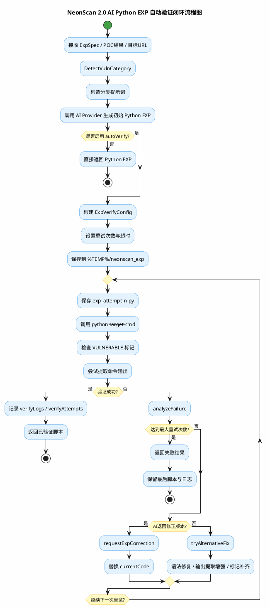

# NeonScan AI-EXP 自动验证闭环流程图 2.0 最终版

本文件单独刻画当前 2.0 代码里最有代表性的闭环能力：`POC结果 -> ExpSpec -> AI生成Python EXP -> 自动验证 -> 失败分析 -> AI/规则修正 -> 重试`。

## 证据来源

- `ai_exp.go`
- `ai_exp_batch.go`
- `ai_exp_verify.go`
- `main_autoscan_exploit_verify.go`

## PlantUML

## 修正点

- 明确 `autoVerify=true` 才进入自动验证闭环
- 明确输出并不是一次完成，而是 `生成 -> 执行 -> 分析 -> 修正 -> 重试`
- 明确两种修正来源：
  - `AI 返回修正版本`
  - `规则级备用修复`
- 明确这条闭环既可来自单个 `/ai/exp/python`，也可来自 `AI 自动扫描` 后的批量生成验证

