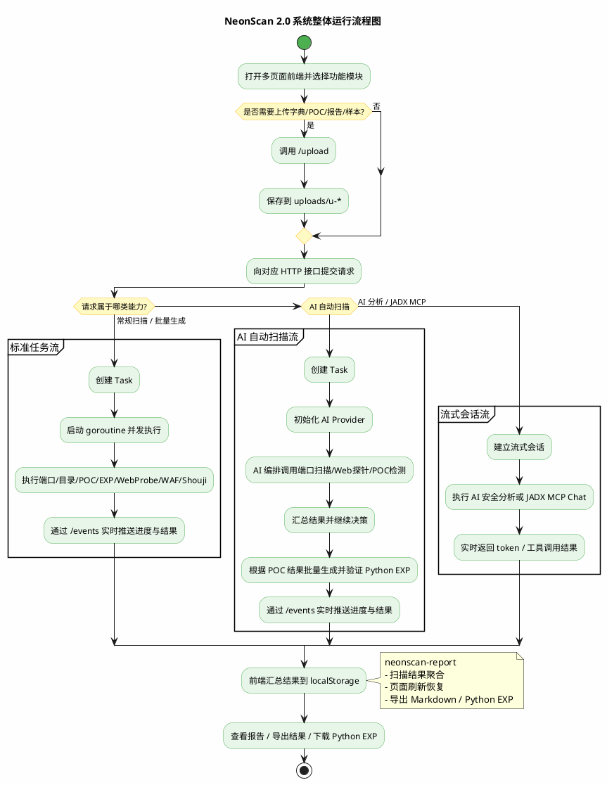

# NeonScan 系统整体流程图 2.0 最终版

本文件依据当前 `bishe00-master` 代码、前端页面与 2.0 图谱规范整理，重点修正旧版流程图中路由错误、功能分支缺失、AI/资产收集/MCP 表达不准确等问题。

## 证据来源

- `main.go`
  - 路由注册、`Task`/`SSEMessage`、`aiAutoScanHandler`
- `web/*.html`、`web/app.js`
  - 多页面入口、报告汇总、localStorage 持久化
- `internal/shouji/shouji.go`
  - `FFUF`、`URLFinder`、`Packer-Fuzzer`
- `ai_exp.go`、`ai_exp_batch.go`、`ai_exp_verify.go`
  - Python EXP 生成、批量生成、自动验证与修正
- `main_autoscan_exploit_verify.go`
  - AI 自动扫描结束后批量生成并验证 Python EXP

## PlantUML

## 修正点

- 路由改为真实路径，如 `/scan/ports`、`/scan/poc`、`/events`、`/upload`
- 明确补入 `EXP验证`、`WAF绕过`、`资产收集`、`扫描报告`
- 区分三类主流程：常规扫描、AI 自动扫描、流式 AI/MCP 会话
- 明确 AI 自动扫描后还会进入 `批量生成并验证 Python EXP`
- 不再把 MCP 统称为泛化工具，当前 2.0 主落地为 `JADX MCP`

